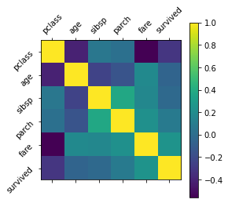
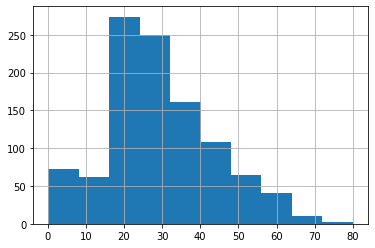

### Pandas for Machine Learning
Data manipulation using the Pandas library.

### Set up
First we'll import the NumPy and Pandas libraries and set seeds for reproducibility. We'll also download the dataset we'll be working with to disk.


```python
import numpy as np
import pandas as pd
```


```python
# Set seed for reproducibility
np.random.seed(seed=1234)
```

### Load data
We're going to work with the [Titanic dataset](https://www.kaggle.com/c/titanic/data) which has data on the people who embarked the RMS Titanic in 1912 and whether they survived the expedition or not. It's a very common and rich dataset which makes it very apt for exploratory data analysis with Pandas.

Let's load the data from the CSV file into a Pandas dataframe. The `header=0` signifies that the first row (0th index) is a header row which contains the names of each column in our dataset.


```python
# Read from CSV to Pandas DataFrame
url = "https://raw.githubusercontent.com/GokuMohandas/MadeWithML/main/datasets/titanic.csv"
df = pd.read_csv(url, header=0)
```


```python
# First few items
df.head(3)
```


<div>
<style scoped>
    .dataframe tbody tr th:only-of-type {
        vertical-align: middle;
    }

    .dataframe tbody tr th {
        vertical-align: top;
    }

    .dataframe thead th {
        text-align: right;
    }
</style>
<table border="1" class="dataframe">
  <thead>
    <tr style="text-align: right;">
      <th></th>
      <th>pclass</th>
      <th>name</th>
      <th>sex</th>
      <th>age</th>
      <th>sibsp</th>
      <th>parch</th>
      <th>ticket</th>
      <th>fare</th>
      <th>cabin</th>
      <th>embarked</th>
      <th>survived</th>
    </tr>
  </thead>
  <tbody>
    <tr>
      <th>0</th>
      <td>1</td>
      <td>Allen, Miss. Elisabeth Walton</td>
      <td>female</td>
      <td>29.0000</td>
      <td>0</td>
      <td>0</td>
      <td>24160</td>
      <td>211.3375</td>
      <td>B5</td>
      <td>S</td>
      <td>1</td>
    </tr>
    <tr>
      <th>1</th>
      <td>1</td>
      <td>Allison, Master. Hudson Trevor</td>
      <td>male</td>
      <td>0.9167</td>
      <td>1</td>
      <td>2</td>
      <td>113781</td>
      <td>151.5500</td>
      <td>C22 C26</td>
      <td>S</td>
      <td>1</td>
    </tr>
    <tr>
      <th>2</th>
      <td>1</td>
      <td>Allison, Miss. Helen Loraine</td>
      <td>female</td>
      <td>2.0000</td>
      <td>1</td>
      <td>2</td>
      <td>113781</td>
      <td>151.5500</td>
      <td>C22 C26</td>
      <td>S</td>
      <td>0</td>
    </tr>
  </tbody>
</table>
</div>


### Exploratory data analysis (EDA)
Now that we loaded our data, we're ready to start exploring it to find interesting information.

Be sure to check out our entire lesson focused on [EDA](https://madewithml.com/courses/mlops/exploratory-data-analysis/) in our [MLOps](https://madewithml.com/courses/mlops/) course.


```python
import matplotlib.pyplot as plt
```

We can use `.describe()` to extract some standard details about our numerical features.


```python
# Describe features
df.describe()
```


<div>
<style scoped>
    .dataframe tbody tr th:only-of-type {
        vertical-align: middle;
    }

    .dataframe tbody tr th {
        vertical-align: top;
    }

    .dataframe thead th {
        text-align: right;
    }
</style>
<table border="1" class="dataframe">
  <thead>
    <tr style="text-align: right;">
      <th></th>
      <th>pclass</th>
      <th>age</th>
      <th>sibsp</th>
      <th>parch</th>
      <th>fare</th>
      <th>survived</th>
    </tr>
  </thead>
  <tbody>
    <tr>
      <th>count</th>
      <td>1309.000000</td>
      <td>1046.000000</td>
      <td>1309.000000</td>
      <td>1309.000000</td>
      <td>1308.000000</td>
      <td>1309.000000</td>
    </tr>
    <tr>
      <th>mean</th>
      <td>2.294882</td>
      <td>29.881135</td>
      <td>0.498854</td>
      <td>0.385027</td>
      <td>33.295479</td>
      <td>0.381971</td>
    </tr>
    <tr>
      <th>std</th>
      <td>0.837836</td>
      <td>14.413500</td>
      <td>1.041658</td>
      <td>0.865560</td>
      <td>51.758668</td>
      <td>0.486055</td>
    </tr>
    <tr>
      <th>min</th>
      <td>1.000000</td>
      <td>0.166700</td>
      <td>0.000000</td>
      <td>0.000000</td>
      <td>0.000000</td>
      <td>0.000000</td>
    </tr>
    <tr>
      <th>25%</th>
      <td>2.000000</td>
      <td>21.000000</td>
      <td>0.000000</td>
      <td>0.000000</td>
      <td>7.895800</td>
      <td>0.000000</td>
    </tr>
    <tr>
      <th>50%</th>
      <td>3.000000</td>
      <td>28.000000</td>
      <td>0.000000</td>
      <td>0.000000</td>
      <td>14.454200</td>
      <td>0.000000</td>
    </tr>
    <tr>
      <th>75%</th>
      <td>3.000000</td>
      <td>39.000000</td>
      <td>1.000000</td>
      <td>0.000000</td>
      <td>31.275000</td>
      <td>1.000000</td>
    </tr>
    <tr>
      <th>max</th>
      <td>3.000000</td>
      <td>80.000000</td>
      <td>8.000000</td>
      <td>9.000000</td>
      <td>512.329200</td>
      <td>1.000000</td>
    </tr>
  </tbody>
</table>
</div>


```python
# Correlation matrix
plt.matshow(df.corr())
continuous_features = df.describe().columns
plt.xticks(range(len(continuous_features)), continuous_features, rotation="45")
plt.yticks(range(len(continuous_features)), continuous_features, rotation="45")
plt.colorbar()
plt.show()
```


    

    


We can also use `.hist()` to view the histrogram of values for each feature.


```python
# Histograms
df["age"].hist()
```


    <AxesSubplot:>


    

    


### Filtering
We can filter our data by features and even by specific values (or value ranges) within specific features.


```python
# Selecting data by feature
df["name"].head()
```


    0                      Allen, Miss. Elisabeth Walton
    1                     Allison, Master. Hudson Trevor
    2                       Allison, Miss. Helen Loraine
    3               Allison, Mr. Hudson Joshua Creighton
    4    Allison, Mrs. Hudson J C (Bessie Waldo Daniels)
    Name: name, dtype: object


```python
# Filtering
df[df["sex"]=="female"].head() # only the female data appear
```


<div>
<style scoped>
    .dataframe tbody tr th:only-of-type {
        vertical-align: middle;
    }

    .dataframe tbody tr th {
        vertical-align: top;
    }

    .dataframe thead th {
        text-align: right;
    }
</style>
<table border="1" class="dataframe">
  <thead>
    <tr style="text-align: right;">
      <th></th>
      <th>pclass</th>
      <th>name</th>
      <th>sex</th>
      <th>age</th>
      <th>sibsp</th>
      <th>parch</th>
      <th>ticket</th>
      <th>fare</th>
      <th>cabin</th>
      <th>embarked</th>
      <th>survived</th>
    </tr>
  </thead>
  <tbody>
    <tr>
      <th>0</th>
      <td>1</td>
      <td>Allen, Miss. Elisabeth Walton</td>
      <td>female</td>
      <td>29.0</td>
      <td>0</td>
      <td>0</td>
      <td>24160</td>
      <td>211.3375</td>
      <td>B5</td>
      <td>S</td>
      <td>1</td>
    </tr>
    <tr>
      <th>2</th>
      <td>1</td>
      <td>Allison, Miss. Helen Loraine</td>
      <td>female</td>
      <td>2.0</td>
      <td>1</td>
      <td>2</td>
      <td>113781</td>
      <td>151.5500</td>
      <td>C22 C26</td>
      <td>S</td>
      <td>0</td>
    </tr>
    <tr>
      <th>4</th>
      <td>1</td>
      <td>Allison, Mrs. Hudson J C (Bessie Waldo Daniels)</td>
      <td>female</td>
      <td>25.0</td>
      <td>1</td>
      <td>2</td>
      <td>113781</td>
      <td>151.5500</td>
      <td>C22 C26</td>
      <td>S</td>
      <td>0</td>
    </tr>
    <tr>
      <th>6</th>
      <td>1</td>
      <td>Andrews, Miss. Kornelia Theodosia</td>
      <td>female</td>
      <td>63.0</td>
      <td>1</td>
      <td>0</td>
      <td>13502</td>
      <td>77.9583</td>
      <td>D7</td>
      <td>S</td>
      <td>1</td>
    </tr>
    <tr>
      <th>8</th>
      <td>1</td>
      <td>Appleton, Mrs. Edward Dale (Charlotte Lamson)</td>
      <td>female</td>
      <td>53.0</td>
      <td>2</td>
      <td>0</td>
      <td>11769</td>
      <td>51.4792</td>
      <td>C101</td>
      <td>S</td>
      <td>1</td>
    </tr>
  </tbody>
</table>
</div>


### Sorting
We can also sort our features in ascending or descending order.


```python
# Sorting
df.sort_values("age", ascending=False).head()
```


<div>
<style scoped>
    .dataframe tbody tr th:only-of-type {
        vertical-align: middle;
    }

    .dataframe tbody tr th {
        vertical-align: top;
    }

    .dataframe thead th {
        text-align: right;
    }
</style>
<table border="1" class="dataframe">
  <thead>
    <tr style="text-align: right;">
      <th></th>
      <th>pclass</th>
      <th>name</th>
      <th>sex</th>
      <th>age</th>
      <th>sibsp</th>
      <th>parch</th>
      <th>ticket</th>
      <th>fare</th>
      <th>cabin</th>
      <th>embarked</th>
      <th>survived</th>
    </tr>
  </thead>
  <tbody>
    <tr>
      <th>14</th>
      <td>1</td>
      <td>Barkworth, Mr. Algernon Henry Wilson</td>
      <td>male</td>
      <td>80.0</td>
      <td>0</td>
      <td>0</td>
      <td>27042</td>
      <td>30.0000</td>
      <td>A23</td>
      <td>S</td>
      <td>1</td>
    </tr>
    <tr>
      <th>61</th>
      <td>1</td>
      <td>Cavendish, Mrs. Tyrell William (Julia Florence...</td>
      <td>female</td>
      <td>76.0</td>
      <td>1</td>
      <td>0</td>
      <td>19877</td>
      <td>78.8500</td>
      <td>C46</td>
      <td>S</td>
      <td>1</td>
    </tr>
    <tr>
      <th>1235</th>
      <td>3</td>
      <td>Svensson, Mr. Johan</td>
      <td>male</td>
      <td>74.0</td>
      <td>0</td>
      <td>0</td>
      <td>347060</td>
      <td>7.7750</td>
      <td>NaN</td>
      <td>S</td>
      <td>0</td>
    </tr>
    <tr>
      <th>135</th>
      <td>1</td>
      <td>Goldschmidt, Mr. George B</td>
      <td>male</td>
      <td>71.0</td>
      <td>0</td>
      <td>0</td>
      <td>PC 17754</td>
      <td>34.6542</td>
      <td>A5</td>
      <td>C</td>
      <td>0</td>
    </tr>
    <tr>
      <th>9</th>
      <td>1</td>
      <td>Artagaveytia, Mr. Ramon</td>
      <td>male</td>
      <td>71.0</td>
      <td>0</td>
      <td>0</td>
      <td>PC 17609</td>
      <td>49.5042</td>
      <td>NaN</td>
      <td>C</td>
      <td>0</td>
    </tr>
  </tbody>
</table>
</div>


### Grouping
We can also get statistics across our features for certain groups. Here we wan to see the average of our continuous features based on whether the passenger survived or not.


```python
# Grouping
survived_group = df.groupby("survived")
survived_group.mean()
```


<div>
<style scoped>
    .dataframe tbody tr th:only-of-type {
        vertical-align: middle;
    }

    .dataframe tbody tr th {
        vertical-align: top;
    }

    .dataframe thead th {
        text-align: right;
    }
</style>
<table border="1" class="dataframe">
  <thead>
    <tr style="text-align: right;">
      <th></th>
      <th>pclass</th>
      <th>age</th>
      <th>sibsp</th>
      <th>parch</th>
      <th>fare</th>
    </tr>
    <tr>
      <th>survived</th>
      <th></th>
      <th></th>
      <th></th>
      <th></th>
      <th></th>
    </tr>
  </thead>
  <tbody>
    <tr>
      <th>0</th>
      <td>2.500618</td>
      <td>30.545369</td>
      <td>0.521632</td>
      <td>0.328801</td>
      <td>23.353831</td>
    </tr>
    <tr>
      <th>1</th>
      <td>1.962000</td>
      <td>28.918228</td>
      <td>0.462000</td>
      <td>0.476000</td>
      <td>49.361184</td>
    </tr>
  </tbody>
</table>
</div>


### Indexing
We can use iloc to get rows or columns at particular positions in the dataframe.


```python
# Selecting row 0
df.iloc[0, :]
```


    pclass                                  1
    name        Allen, Miss. Elisabeth Walton
    sex                                female
    age                                  29.0
    sibsp                                   0
    parch                                   0
    ticket                              24160
    fare                             211.3375
    cabin                                  B5
    embarked                                S
    survived                                1
    Name: 0, dtype: object


```python
# Selecting a specific value
df.iloc[0, 1]
```


    'Allen, Miss. Elisabeth Walton'


### Preprocessing
- After exploring, we can clean and preprocess our dataset.

- Be sure to check out our entire lesson focused on preprocessing in our MLOps course.


```python
# Rows with at least one NaN value
df[pd.isnull(df).any(axis=1)].head()
```


<div>
<style scoped>
    .dataframe tbody tr th:only-of-type {
        vertical-align: middle;
    }

    .dataframe tbody tr th {
        vertical-align: top;
    }

    .dataframe thead th {
        text-align: right;
    }
</style>
<table border="1" class="dataframe">
  <thead>
    <tr style="text-align: right;">
      <th></th>
      <th>pclass</th>
      <th>name</th>
      <th>sex</th>
      <th>age</th>
      <th>sibsp</th>
      <th>parch</th>
      <th>ticket</th>
      <th>fare</th>
      <th>cabin</th>
      <th>embarked</th>
      <th>survived</th>
    </tr>
  </thead>
  <tbody>
    <tr>
      <th>9</th>
      <td>1</td>
      <td>Artagaveytia, Mr. Ramon</td>
      <td>male</td>
      <td>71.0</td>
      <td>0</td>
      <td>0</td>
      <td>PC 17609</td>
      <td>49.5042</td>
      <td>NaN</td>
      <td>C</td>
      <td>0</td>
    </tr>
    <tr>
      <th>13</th>
      <td>1</td>
      <td>Barber, Miss. Ellen "Nellie"</td>
      <td>female</td>
      <td>26.0</td>
      <td>0</td>
      <td>0</td>
      <td>19877</td>
      <td>78.8500</td>
      <td>NaN</td>
      <td>S</td>
      <td>1</td>
    </tr>
    <tr>
      <th>15</th>
      <td>1</td>
      <td>Baumann, Mr. John D</td>
      <td>male</td>
      <td>NaN</td>
      <td>0</td>
      <td>0</td>
      <td>PC 17318</td>
      <td>25.9250</td>
      <td>NaN</td>
      <td>S</td>
      <td>0</td>
    </tr>
    <tr>
      <th>23</th>
      <td>1</td>
      <td>Bidois, Miss. Rosalie</td>
      <td>female</td>
      <td>42.0</td>
      <td>0</td>
      <td>0</td>
      <td>PC 17757</td>
      <td>227.5250</td>
      <td>NaN</td>
      <td>C</td>
      <td>1</td>
    </tr>
    <tr>
      <th>25</th>
      <td>1</td>
      <td>Birnbaum, Mr. Jakob</td>
      <td>male</td>
      <td>25.0</td>
      <td>0</td>
      <td>0</td>
      <td>13905</td>
      <td>26.0000</td>
      <td>NaN</td>
      <td>C</td>
      <td>0</td>
    </tr>
  </tbody>
</table>
</div>


```python
# Drop rows with Nan values
df = df.dropna() # removes rows with any NaN values
df = df.reset_index() # reset's row indexes in case any rows were dropped
df.head()
```


<div>
<style scoped>
    .dataframe tbody tr th:only-of-type {
        vertical-align: middle;
    }

    .dataframe tbody tr th {
        vertical-align: top;
    }

    .dataframe thead th {
        text-align: right;
    }
</style>
<table border="1" class="dataframe">
  <thead>
    <tr style="text-align: right;">
      <th></th>
      <th>index</th>
      <th>pclass</th>
      <th>name</th>
      <th>sex</th>
      <th>age</th>
      <th>sibsp</th>
      <th>parch</th>
      <th>ticket</th>
      <th>fare</th>
      <th>cabin</th>
      <th>embarked</th>
      <th>survived</th>
    </tr>
  </thead>
  <tbody>
    <tr>
      <th>0</th>
      <td>0</td>
      <td>1</td>
      <td>Allen, Miss. Elisabeth Walton</td>
      <td>female</td>
      <td>29.0000</td>
      <td>0</td>
      <td>0</td>
      <td>24160</td>
      <td>211.3375</td>
      <td>B5</td>
      <td>S</td>
      <td>1</td>
    </tr>
    <tr>
      <th>1</th>
      <td>1</td>
      <td>1</td>
      <td>Allison, Master. Hudson Trevor</td>
      <td>male</td>
      <td>0.9167</td>
      <td>1</td>
      <td>2</td>
      <td>113781</td>
      <td>151.5500</td>
      <td>C22 C26</td>
      <td>S</td>
      <td>1</td>
    </tr>
    <tr>
      <th>2</th>
      <td>2</td>
      <td>1</td>
      <td>Allison, Miss. Helen Loraine</td>
      <td>female</td>
      <td>2.0000</td>
      <td>1</td>
      <td>2</td>
      <td>113781</td>
      <td>151.5500</td>
      <td>C22 C26</td>
      <td>S</td>
      <td>0</td>
    </tr>
    <tr>
      <th>3</th>
      <td>3</td>
      <td>1</td>
      <td>Allison, Mr. Hudson Joshua Creighton</td>
      <td>male</td>
      <td>30.0000</td>
      <td>1</td>
      <td>2</td>
      <td>113781</td>
      <td>151.5500</td>
      <td>C22 C26</td>
      <td>S</td>
      <td>0</td>
    </tr>
    <tr>
      <th>4</th>
      <td>4</td>
      <td>1</td>
      <td>Allison, Mrs. Hudson J C (Bessie Waldo Daniels)</td>
      <td>female</td>
      <td>25.0000</td>
      <td>1</td>
      <td>2</td>
      <td>113781</td>
      <td>151.5500</td>
      <td>C22 C26</td>
      <td>S</td>
      <td>0</td>
    </tr>
  </tbody>
</table>
</div>


```python
# Dropping multiple columns
df = df.drop(["name", "cabin", "ticket"], axis=1) # we won't use text features for our initial basic models
df.head()
```


<div>
<style scoped>
    .dataframe tbody tr th:only-of-type {
        vertical-align: middle;
    }

    .dataframe tbody tr th {
        vertical-align: top;
    }

    .dataframe thead th {
        text-align: right;
    }
</style>
<table border="1" class="dataframe">
  <thead>
    <tr style="text-align: right;">
      <th></th>
      <th>index</th>
      <th>pclass</th>
      <th>sex</th>
      <th>age</th>
      <th>sibsp</th>
      <th>parch</th>
      <th>fare</th>
      <th>embarked</th>
      <th>survived</th>
    </tr>
  </thead>
  <tbody>
    <tr>
      <th>0</th>
      <td>0</td>
      <td>1</td>
      <td>female</td>
      <td>29.0000</td>
      <td>0</td>
      <td>0</td>
      <td>211.3375</td>
      <td>S</td>
      <td>1</td>
    </tr>
    <tr>
      <th>1</th>
      <td>1</td>
      <td>1</td>
      <td>male</td>
      <td>0.9167</td>
      <td>1</td>
      <td>2</td>
      <td>151.5500</td>
      <td>S</td>
      <td>1</td>
    </tr>
    <tr>
      <th>2</th>
      <td>2</td>
      <td>1</td>
      <td>female</td>
      <td>2.0000</td>
      <td>1</td>
      <td>2</td>
      <td>151.5500</td>
      <td>S</td>
      <td>0</td>
    </tr>
    <tr>
      <th>3</th>
      <td>3</td>
      <td>1</td>
      <td>male</td>
      <td>30.0000</td>
      <td>1</td>
      <td>2</td>
      <td>151.5500</td>
      <td>S</td>
      <td>0</td>
    </tr>
    <tr>
      <th>4</th>
      <td>4</td>
      <td>1</td>
      <td>female</td>
      <td>25.0000</td>
      <td>1</td>
      <td>2</td>
      <td>151.5500</td>
      <td>S</td>
      <td>0</td>
    </tr>
  </tbody>
</table>
</div>


```python
# Map feature values
df["sex"] = df["sex"].map( {"female": 0, "male": 1} ).astype(int)
df["embarked"] = df["embarked"].dropna().map( {"S":0, "C":1, "Q":2} ).astype(int)
df.head()
```


<div>
<style scoped>
    .dataframe tbody tr th:only-of-type {
        vertical-align: middle;
    }

    .dataframe tbody tr th {
        vertical-align: top;
    }

    .dataframe thead th {
        text-align: right;
    }
</style>
<table border="1" class="dataframe">
  <thead>
    <tr style="text-align: right;">
      <th></th>
      <th>index</th>
      <th>pclass</th>
      <th>sex</th>
      <th>age</th>
      <th>sibsp</th>
      <th>parch</th>
      <th>fare</th>
      <th>embarked</th>
      <th>survived</th>
    </tr>
  </thead>
  <tbody>
    <tr>
      <th>0</th>
      <td>0</td>
      <td>1</td>
      <td>0</td>
      <td>29.0000</td>
      <td>0</td>
      <td>0</td>
      <td>211.3375</td>
      <td>0</td>
      <td>1</td>
    </tr>
    <tr>
      <th>1</th>
      <td>1</td>
      <td>1</td>
      <td>1</td>
      <td>0.9167</td>
      <td>1</td>
      <td>2</td>
      <td>151.5500</td>
      <td>0</td>
      <td>1</td>
    </tr>
    <tr>
      <th>2</th>
      <td>2</td>
      <td>1</td>
      <td>0</td>
      <td>2.0000</td>
      <td>1</td>
      <td>2</td>
      <td>151.5500</td>
      <td>0</td>
      <td>0</td>
    </tr>
    <tr>
      <th>3</th>
      <td>3</td>
      <td>1</td>
      <td>1</td>
      <td>30.0000</td>
      <td>1</td>
      <td>2</td>
      <td>151.5500</td>
      <td>0</td>
      <td>0</td>
    </tr>
    <tr>
      <th>4</th>
      <td>4</td>
      <td>1</td>
      <td>0</td>
      <td>25.0000</td>
      <td>1</td>
      <td>2</td>
      <td>151.5500</td>
      <td>0</td>
      <td>0</td>
    </tr>
  </tbody>
</table>
</div>


### Feature engineering
We're now going to use feature engineering to create a column called `family_size`. We'll first define a function called `get_family_size` that will determine the family size using the number of parents and siblings.


```python
# Lambda expressions to create new features
def get_family_size(sibsp, parch):
    family_size = sibsp + parch
    return family_size
```

Once we define the function, we can use `lambda` to apply that function on each row (using the numbers of siblings and parents in each row to determine the family size for each row).


```python
df["family_size"] = df[["sibsp", "parch"]].apply(lambda x: get_family_size(x["sibsp"], x["parch"]), axis=1)
df.head()
```


<div>
<style scoped>
    .dataframe tbody tr th:only-of-type {
        vertical-align: middle;
    }

    .dataframe tbody tr th {
        vertical-align: top;
    }

    .dataframe thead th {
        text-align: right;
    }
</style>
<table border="1" class="dataframe">
  <thead>
    <tr style="text-align: right;">
      <th></th>
      <th>index</th>
      <th>pclass</th>
      <th>sex</th>
      <th>age</th>
      <th>sibsp</th>
      <th>parch</th>
      <th>fare</th>
      <th>embarked</th>
      <th>survived</th>
      <th>family_size</th>
    </tr>
  </thead>
  <tbody>
    <tr>
      <th>0</th>
      <td>0</td>
      <td>1</td>
      <td>0</td>
      <td>29.0000</td>
      <td>0</td>
      <td>0</td>
      <td>211.3375</td>
      <td>0</td>
      <td>1</td>
      <td>0</td>
    </tr>
    <tr>
      <th>1</th>
      <td>1</td>
      <td>1</td>
      <td>1</td>
      <td>0.9167</td>
      <td>1</td>
      <td>2</td>
      <td>151.5500</td>
      <td>0</td>
      <td>1</td>
      <td>3</td>
    </tr>
    <tr>
      <th>2</th>
      <td>2</td>
      <td>1</td>
      <td>0</td>
      <td>2.0000</td>
      <td>1</td>
      <td>2</td>
      <td>151.5500</td>
      <td>0</td>
      <td>0</td>
      <td>3</td>
    </tr>
    <tr>
      <th>3</th>
      <td>3</td>
      <td>1</td>
      <td>1</td>
      <td>30.0000</td>
      <td>1</td>
      <td>2</td>
      <td>151.5500</td>
      <td>0</td>
      <td>0</td>
      <td>3</td>
    </tr>
    <tr>
      <th>4</th>
      <td>4</td>
      <td>1</td>
      <td>0</td>
      <td>25.0000</td>
      <td>1</td>
      <td>2</td>
      <td>151.5500</td>
      <td>0</td>
      <td>0</td>
      <td>3</td>
    </tr>
  </tbody>
</table>
</div>


```python
# Reorganize headers
df = df[["pclass", "sex", "age", "sibsp", "parch", "family_size", "fare", "embarked", "survived"]]
df.head()
```


<div>
<style scoped>
    .dataframe tbody tr th:only-of-type {
        vertical-align: middle;
    }

    .dataframe tbody tr th {
        vertical-align: top;
    }

    .dataframe thead th {
        text-align: right;
    }
</style>
<table border="1" class="dataframe">
  <thead>
    <tr style="text-align: right;">
      <th></th>
      <th>pclass</th>
      <th>sex</th>
      <th>age</th>
      <th>sibsp</th>
      <th>parch</th>
      <th>family_size</th>
      <th>fare</th>
      <th>embarked</th>
      <th>survived</th>
    </tr>
  </thead>
  <tbody>
    <tr>
      <th>0</th>
      <td>1</td>
      <td>0</td>
      <td>29.0000</td>
      <td>0</td>
      <td>0</td>
      <td>0</td>
      <td>211.3375</td>
      <td>0</td>
      <td>1</td>
    </tr>
    <tr>
      <th>1</th>
      <td>1</td>
      <td>1</td>
      <td>0.9167</td>
      <td>1</td>
      <td>2</td>
      <td>3</td>
      <td>151.5500</td>
      <td>0</td>
      <td>1</td>
    </tr>
    <tr>
      <th>2</th>
      <td>1</td>
      <td>0</td>
      <td>2.0000</td>
      <td>1</td>
      <td>2</td>
      <td>3</td>
      <td>151.5500</td>
      <td>0</td>
      <td>0</td>
    </tr>
    <tr>
      <th>3</th>
      <td>1</td>
      <td>1</td>
      <td>30.0000</td>
      <td>1</td>
      <td>2</td>
      <td>3</td>
      <td>151.5500</td>
      <td>0</td>
      <td>0</td>
    </tr>
    <tr>
      <th>4</th>
      <td>1</td>
      <td>0</td>
      <td>25.0000</td>
      <td>1</td>
      <td>2</td>
      <td>3</td>
      <td>151.5500</td>
      <td>0</td>
      <td>0</td>
    </tr>
  </tbody>
</table>
</div>


### Save data
Finally, let's save our preprocessed data into a new CSV file to use later.


```python
# Saving dataframe to CSV
df.to_csv("processed_titanic.csv", index=False)
```


```python
# See the saved file
os.path.Note()
```


    ---------------------------------------------------------------------------

    NameError                                 Traceback (most recent call last)

    C:\Users\ASHISH~1\AppData\Local\Temp/ipykernel_9352/2582580469.py in <module>
          1 # See the saved file
    ----> 2 os.path.Note()
    

    NameError: name 'os' is not defined

